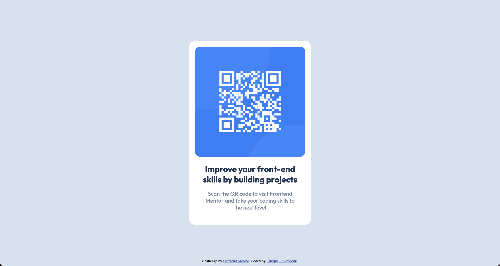

# Frontend Mentor - QR code component solution

This is a solution to the [QR code component challenge on Frontend Mentor](https://www.frontendmentor.io/challenges/qr-code-component-iux_sIO_H). Frontend Mentor challenges help you improve your coding skills by building realistic projects.

## Table of contents

- [Overview](#overview)
  - [Screenshot](#screenshot)
  - [Links](#links)
- [My process](#my-process)
  - [Built with](#built-with)
  - [What I learned](#what-i-learned)
- [Author](#author)

## Overview

### Screenshot

### Links

- Solution URL: (https://github.com/eligijuslinkevicius/frontendmentor-qr-code-component/)
- Live Site URL: (https://eligijuslinkevicius.github.io/frontendmentor-qr-code-component/)

## My process

### Built with

- HTML5
- Sass
- Flexbox
- Mobile-first workflow

### What I learned

Learned how to use Sass and how to center a div in a page.

## Author

- Frontend Mentor - [@eligijuslinkevicius](https://www.frontendmentor.io/profile/eligijuslinkevicius)
- Twitter - [@thelinkev](https://www.twitter.com/thelinkev)
